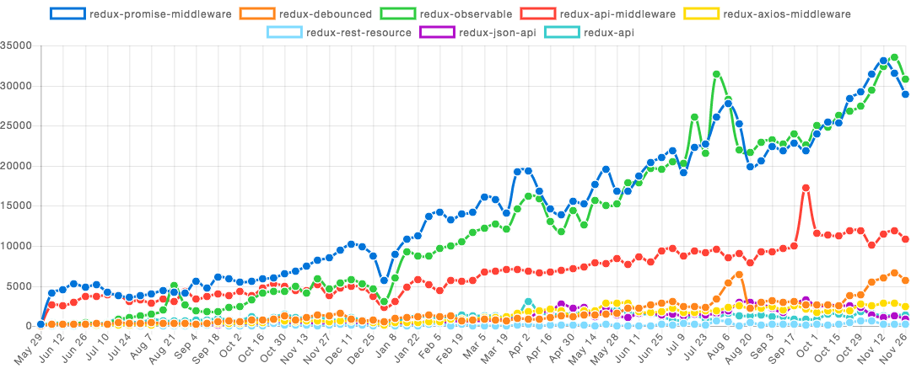

class: center, middle, inverse


# Introduction to Redux Cube

.orange[dexteryy] @ .strikingly[Strikingly]

---

class: left, middle

# Agenda

* Essences of Redux
* Redux Ecosystem
* Redux Cube

---

class: center, middle, inverse

# Quick Review: Essences of Redux

---

# Complexity

> We're mixing two concepts that are very hard for the human mind to reason about ...

* Mutation
* Asynchronicity

.footnote[https://redux.js.org/docs/introduction/Motivation.html]

---

# Three Principles

* Single source of truth
* State is read-only
* Changes are made with pure functions

--

> The state of your whole application is stored in an object tree
>
> The only way to change the state is to emit an action
>
> To specify how the state tree is transformed by actions, you write pure reducers.

.footnote[https://redux.js.org/docs/introduction/ThreePrinciples.html]

---

# Action & Action Type

```js
const ADD_TODO = 'ADD_TODO'

{
  type: ADD_TODO,
  text: 'Build my first Redux app'
}
```

--

> Actions must have a type property that indicates the type of action being performed.
>
> Types should typically be defined as string constants.
>
> Strings are serializable

.footnote[https://redux.js.org/docs/basics/Actions.html]

---

# Action Creator

```js
function addTodo(text) {
  return {
    type: ADD_TODO,
    text,
  }
}
```

--

```js
dispatch(addTodo(text))
```

* `store.dispatch()`
* `import { bindActionCreators } from 'redux'`

> In traditional Flux, action creators often trigger a dispatch when invoked
>
> Binding action creators during their definition means you're stuck with a single store instance

.footnote[https://redux.js.org/docs/basics/Actions.html#action-creators]

---

# Async Action

For any API request you'll want to dispatch at least three different kinds of actions:

* An action informing the reducers that the request began.
* An action informing the reducers that the request finished successfully.
* An action informing the reducers that the request failed.

.footnote[https://redux.js.org/docs/advanced/AsyncActions.html]

--

```js
{ type: 'FETCH_POSTS_REQUEST' }
{ type: 'FETCH_POSTS_FAILURE', payload: error }
{ type: 'FETCH_POSTS_SUCCESS', payload: response }
```

---

# Reducer

```js
(previousState, action) => newState
```

.footnote[https://redux.js.org/docs/basics/Reducers.html]

--

```js
function todoApp(state = initialState, action) {
  switch (state) {
      // ...
  }
  return state;
}
```

---

# Divide Data Into Sub-Trees

* Domain data
* App state
* UI state

--

> __The most common way to organize data within that top-level object:__ divide data into sub-trees, where each top-level key represents some "domain" or "slice" of related data.
>
> __The most common state shape for a Redux app:__ a plain Javascript object containing "slices" of domain-specific data at each top-level key
>
> __The most common approach to writing reducer logic for that state shape:__ "slice reducer" functions
>
> __Slice reducer:__ functions which handle all updates for a given slice of state. These functions do generally have the typical `(state, action)` parameter signature

.footnote[https://redux.js.org/docs/recipes/StructuringReducers.html]

---

# Reducer Composition

slice of the state -> slice reducer


```js
function todoApp(state = {}, action) {
  return {
    visibilityFilter: visibilityFilter(state.visibilityFilter, action),
    todos: todos(state.todos, action),
  };
}
```

.footnote[https://redux.js.org/docs/basics/Reducers.html#splitting-reducers]

--

* `import { combineReducers } from 'redux'`

```js
const todoApp = combineReducers({
  visibilityFilter,
  todos
});
```

---

# Store

The store has the following responsibilities:

* `store.subscribe(listener)`
* `unsubscribe = store.subscribe(listener)`
* `store.dispatch(action)`
* `store.getState()`

--

The Store is the object that brings actions and reducers together.

* `import { createStore } from 'redux'`
* `store = createStore(rootReducer, [preloadedState], [enhancer])`
* The only store enhancer that ships with Redux is `applyMiddleware()`
* To apply multiple store enhancers, you may use `compose()`

.footnote[https://redux.js.org/docs/basics/Store.html, https://redux.js.org/docs/api/createStore.html]

---

```js
let store = createStore(
  combineReducers(reducers),
  compose(
    applyMiddleware(
*     middlewareA,
*     middlewareB,
    ),
*   storeEnhancersA,
*   storeEnhancersB,
  ),
);
```

--

```js
StoreEnhancer = (next: StoreCreator) => StoreCreator
```

```js
Middleware = ({ dispatch, getState }) => (next: Dispatch) => action => Dispatch
```

```js
applyMiddleware(
* middlewareA(middlewareB((
    ({ dispatch, getState }) => originDispatch => { /* ... */ },
  ))),
)(
* storeEnhancersA(storeEnhancersB(
    createStore(/* ... */))
  ),
);
```

---

# Middleware

`middleware = ({ dispatch, getState }) => next => action => dispatchResult`

It provides a third-party extension point between dispatching an action, and the moment it reaches the reducer

```js
const logger = ({
* dispatch, // original disaptch
  getState,
}) => {
* return next /* old dispatch */ => {
    // new dispatch
*   return action => {
      console.log('dispatching', action);
*     let result = next(action);
      console.log('next state', getState());
      return result;
    };
  };
};
```

Without any middleware, dispatch only accepts a plain object

.footnote[https://redux.js.org/docs/advanced/Middleware.html]

---

# Redux + React

[__Presentational Components / Dumb Components__](https://medium.com/@dan_abramov/smart-and-dumb-components-7ca2f9a7c7d0)

* Purpose: __How things look__ (markup, styles)
* Aware of Redux: __No__
* To read data: __Read data from props__
* To change data: __Invoke callbacks from props__
* Are written: __By hand__
* __Most of__ the components we'll write will be presentational

[__Container Components / Smart Components__](https://jaketrent.com/post/smart-dumb-components-react/)

* Purpose: __How things work__ (data fetching, state updates)
* Aware of Redux: __Yes__
* To read data: __Subscribe to Redux state__
* To change data: __Dispatch Redux actions__
* Are written: __Usually generated by React Redux__
* __A few__ container components to connect them to the Redux store

---

# Connect

> Technically, a container component is just a React component that uses `store.subscribe()` to read a part of the Redux state tree and supply props to a presentational component it renders

[React Redux](https://www.npmjs.com/package/react-redux) library's `connect()` function, which provides many useful optimizations to prevent unnecessary re-renders

> All container components need access to the Redux store

A special React Redux component called `<Provider store={store}>` to magically make the store available to all container components in the application without passing it explicitly.

---

```js
const mapStateToProps = state => {
  return {
    todos: getVisibleTodos(state.todos, state.visibilityFilter)
  }
}
```

```js
const mapDispatchToProps = dispatch => {
  return {
    onTodoClick: id => {
      dispatch(toggleTodo(id))
    }
  }
}
```

```js
const VisibleTodoList = connect(
  mapStateToProps,
  mapDispatchToProps
)(TodoList)
```

---

# Reselect

```js
const mapStateToProps = state => {
  return {
*   todos: getVisibleTodos(state.todos, state.visibilityFilter)
  }
}
```

> `todos` is calculated every time the component is updated
>
> Replace `getVisibleTodos` with a __memoized selector__ that recalculates `todos` when the value of `state.todos` or `state.visibilityFilter` changes, but not when changes occur in other (unrelated) parts of the state tree.

* `import { createSelector } from 'reselect'`

.footnote[https://redux.js.org/docs/recipes/ComputingDerivedData.html]

---

```js
// input selectors
const getVisibilityFilter = state => state.visibilityFilter
const getTodos = state => state.todos
*// memoized selector
export const getVisibleTodos = createSelector(
* // input selectors (DO NOT return new data)
  [getVisibilityFilter, getTodos],
* // transform function (always return new data)
  (visibilityFilter, todos) => {
    switch (visibilityFilter) {
      case 'SHOW_ALL':
        return todos
      case 'SHOW_COMPLETED':
        return todos.filter(t => t.completed)
      case 'SHOW_ACTIVE':
        return todos.filter(t => !t.completed)
    }
  }
)
```

If the Redux state tree is mutated in a way that causes the value of an input-selector to change, the selector will call its transform function with the values of the input-selectors as arguments and return the result.

If the values of the input-selectors are the same as the previous call to the selector, it will return the previously computed value instead of calling the transform function.

.footnote[https://www.npmjs.com/package/reselect#creating-a-memoized-selector]

---

__Overview - Structure And Boilerplate__

.big-image[]

---

__Overview - Runtime__

.big-image[]

---

class: inverse

# Redux Ecosystem

Forms:

* High-Order Component
* High-Order Reducer
* Reusable Reducer
* Action Middleware
* Store Enhancer

Problem Domains:

* Connect to React Components
* Action Types, Action Creators, Reducer Switch
* Asnyc Actions
* State
* UI Patterns
* App Behaviours
* Development

---

## Connect to React Components

* [react-redux](https://www.npmjs.com/package/react-redux)
* [reselect](https://www.npmjs.com/package/reselect)
* ~~[redux-ui](https://www.npmjs.com/package/redux-ui)~~
* ~~[redux-connect](https://www.npmjs.com/package/redux-connect) / [redux-async-connect](https://www.npmjs.com/package/redux-async-connect) / [react-refetch](https://www.npmjs.com/package/react-refetch) /  [redial](https://www.npmjs.com/package/redial)~~
* ...

.center.image[]

---

## Action Types, Action Creators, Reducer Switch

* [redux-actions](https://www.npmjs.com/package/redux-actions)
* [flux-standard-action](https://www.npmjs.com/package/flux-standard-action)
* [topologically-combine-reducers](https://www.npmjs.com/package/topologically-combine-reducers)
* ~~[redux-act](https://www.npmjs.com/package/redux-act)~~
* ~~[reduxsauce](https://www.npmjs.com/package/reduxsauce) / [redux-define](https://www.npmjs.com/package/redux-define)~~
* ~~[redux-create-action-types](https://www.npmjs.com/package/redux-create-action-types) / [redux-create-types](https://www.npmjs.com/package/redux-create-types)~~
* ...

.center.image[]

---

## Asnyc Actions

* [redux-thunk](https://www.npmjs.com/package/redux-thunk)
* ~~[redux-saga](https://github.com/redux-saga/redux-saga)~~
* [redux-promise-middleware](https://www.npmjs.com/package/redux-promise-middleware)
* [redux-debounced](https://www.npmjs.com/package/redux-debounced)
* [redux-observable](https://www.npmjs.com/package/redux-observable)
* [redux-api-middleware](https://www.npmjs.com/package/redux-api-middleware) / [redux-axios-middleware](https://www.npmjs.com/package/redux-axios-middleware) / [redux-socket.io](http://npmjs.com/redux-socket.io)
* ~~[redux-rest-resource](https://www.npmjs.com/package/redux-rest-resource)  / [redux-json-api](https://www.npmjs.com/package/redux-json-api) / [redux-api](https://www.npmjs.com/package/redux-api)~~
* ...

---

## Asnyc Actions

.center.small-image[]

.center.small-image[]

---

## State

* [normalizr](https://www.npmjs.com/package/normalizr)
* [immutability-helper](https://www.npmjs.com/package/immutability-helper) / [icepick](https://www.npmjs.com/package/icepick) / [seamless-immutable](https://www.npmjs.com/package/seamless-immutable) / [dot-prop-immutable](https://www.npmjs.com/package/dot-prop-immutable) / [object-path-immutable](https://www.npmjs.com/package/object-path-immutable) / [timm](https://www.npmjs.com/package/timm) / [updeep](https://www.npmjs.com/package/updeep)
* [redux-immutable](https://www.npmjs.com/package/redux-immutable)
* [redux-persist](https://www.npmjs.com/package/redux-persist)
* [redux-undo](https://www.npmjs.com/package/redux-undo)
* [redux-reset](https://www.npmjs.com/package/redux-reset)
* ~~[redux-db](https://www.npmjs.com/package/redux-db) / [redux-orm](https://www.npmjs.com/package/redux-orm)~~
* ...

---

## State

.center.small-image[]

.center.small-image[]

---

## UI Patterns

* [redux-form](https://redux-form.com/)
* [react-block-ui](https://www.npmjs.com/package/react-block-ui) / [react-redux-loading-bar](https://www.npmjs.com/package/react-redux-loading-bar)
* [react-notification-system-redux](https://www.npmjs.com/package/react-notification-system-redux) / [react-redux-toastr](https://www.npmjs.com/package/react-redux-toastr)
* [redux-optimistic-ui](https://www.npmjs.com/package/redux-optimistic-ui)
* ...

---

## App Behaviours

* [redux-auth-wrapper](https://www.npmjs.com/package/redux-auth-wrapper)
* [react-intl-redux](https://www.npmjs.com/package/react-intl-redux)
* [redux-segment](https://www.npmjs.com/package/redux-segment)
* [redux-raven-middleware](https://www.npmjs.com/package/redux-raven-middleware) / [raven-for-redux](https://www.npmjs.com/package/raven-for-redux)
* [redux-catch](https://www.npmjs.com/package/redux-catch)
* [redux-beacon](https://www.npmjs.com/package/redux-beacon)
* ...

---

## Development

* [redux-devtools-extension](https://www.npmjs.com/package/redux-devtools-extension)
* [redux-logger](https://www.npmjs.com/package/redux-logger)
* [redux-test-utils](https://www.npmjs.com/package/redux-test-utils) + [enzyme-redux](https://www.npmjs.com/package/enzyme-redux)
* [redux-testkit](https://www.npmjs.com/package/redux-testkit)
* ...

---

class: center, middle, inverse

# Redux Cube

Reduce Boilerplate + Take Advantage of Redux Ecosystem And Best Practices

https://www.npmjs.com/package/redux-cube

---

class: left, middle

> Redux lets us choose how verbose we'd like our code to be, depending on personal style, team preferences, longer term maintainability, and so on.

---

# Action Type

> It is traditionally thought that you would define every action type as a string constant

For larger projects, there are some benefits:

* It helps keep the naming consistent because all action types are gathered in a single place.
* Sometimes you want to see all existing actions before working on a new feature. It may be that the action you need was already added by somebody on the team, but you didn't know.
* The list of action types that were added, removed, and changed in a Pull Request helps everyone on the team keep track of scope and implementation of new features.
* If you make a typo when importing an action constant, you will get undefined. Redux will immediately throw when dispatching such an action, and you'll find the mistake sooner.

---

class: center, middle

[Demo: Action Types in Redux Cube](https://github.com/dexteryy/Project-WebCube/tree/master/packages/redux-cube#action-type)

---

# Action Creators

Action creators let you decouple additional logic around dispatching an action, from the actual components emitting those actions

---

class: center, middle

[Demo: Action Creators in Redux Cube](https://github.com/dexteryy/Project-WebCube/tree/master/packages/redux-cube#action-creators)

---

# Reducers

The switch statement is not the real boilerplate

The real boilerplate of Flux -> event emitters

> If you don't like switch, you can solve this with a single function. Redux doesn't provide such a helper function by default because there are many ways to write it. There may be different approaches to a “catch all” handler. All of this depends on the conventions you choose for your team on a specific project.

---

class: center, middle

[Demo: Reducers in Redux Cube](https://github.com/dexteryy/Project-WebCube/tree/master/packages/redux-cube#reducers)

---

# Async Action Creators / Side Effects

> Middleware is not about “letting you dispatch functions”. It's about letting you dispatch anything that the particular middleware you use knows how to handle

* [redux-thunk](https://www.npmjs.com/package/redux-thunk)
* [redux-promise-middleware](https://www.npmjs.com/package/redux-promise-middleware)
* [redux-cube's Thunk Payload Middleware](https://github.com/dexteryy/Project-WebCube/blob/master/packages/redux-cube/lib/middlewares/thunkPayload.js)
* [redux-debounced](https://www.npmjs.com/package/redux-debounced)
* [redux-observable](https://www.npmjs.com/package/redux-observable)

---

class: center, middle

[Demo: Async Action Creators in Redux Cube](https://github.com/dexteryy/Project-WebCube/tree/master/packages/redux-cube#async-action-creators--side-effects)

---

# Ducks Modular / Reducer Bundle

Original Ducks Modular:

```js
// widgets.js

// Action Types

// Action Creators

// Side Effects
// e.g. thunks, epics, etc

// Reducer
```

---

class: center, middle

[Demo: Ducks Modular in Redux Cube](https://github.com/dexteryy/Project-WebCube/tree/master/packages/redux-cube#ducks-modular--reducer-bundle)

---

class: left, middle

# createHub

An superset and enhanced implement (almost a rewrite) of [redux-actions](https://www.npmjs.com/package/redux-actions).

It provides the support for namespace management and [Reducer-Bundle-or-Ducks-Modular-like pattern](https://medium.freecodecamp.org/scaling-your-redux-app-with-ducks-6115955638be)

---

class: center, middle

[Demo: Connect to React Components in Redux Cube](https://github.com/dexteryy/Project-WebCube/tree/master/packages/redux-cube#connect-to-react-components)

---

class: left, middle

# connect

It's mainly a wrapper of [react-redux](https://www.npmjs.com/package/react-redux) and  [reselect](https://www.npmjs.com/package/reselect)

---

# Sub-Apps

> Sub-Apps won't share data or actions, and won't see or communicate with each other
>
> The bigger app has zero access to the smaller apps' internals
>
> We'd like to keep the fact that they are implemented with Redux as an implementation detail

---

class: center, middle

[Demo: Sub Apps in Redux Cube](https://github.com/dexteryy/Project-WebCube/tree/master/packages/redux-cube#sub-apps)

---

class: left, middle

# createApp

It's mainly a wrapper of [redux API](https://redux.js.org/docs/api/) and some must-have action middlewares, store enhancers, high-order reducers and high-order components.

It provides the support for [Sub-App pattern](https://gist.github.com/gaearon/eeee2f619620ab7b55673a4ee2bf8400) (React component with its own isolated Redux store)

---

class: left, middle

# Plugins

```js
import withPersist from 'redux-cube/lib/plugins/withPersist'
```

Add support to `createApp` for [redux-persist](https://www.npmjs.com/package/redux-persist)

```js
import withImmutable from 'redux-cube/lib/plugins/withImmutable'
```

Add support to `createApp` for [redux-immutable](https://www.npmjs.com/package/redux-immutable)

```js
import withRouter from 'redux-cube-withrouter'
```

Add support to `createApp` for [react-router v4+](https://reacttraining.com/react-router/) + [react-router-redux v5+](https://github.com/reacttraining/react-router/tree/master/packages/react-router-redux)

```js
import withRouter3 from 'redux-cube-withrouter3'
```

Add support to `createApp` for [react-router v3](https://github.com/ReactTraining/react-router/tree/v3/docs) + [react-router-redux v4](https://github.com/reactjs/react-router-redux)

---

# Immutable.JS

What are the issues with using Immutable.JS?

* Difficult to interoperate with
* Once used, Immutable.JS will spread throughout your codebase
* No Destructuring or Spread Operators
* Not suitable for small values that change often
* Difficult to Debug
* Breaks object references, causing poor performance

---

class: center, middle

[Demo: Immutabble in Redux Cube](https://github.com/dexteryy/Project-WebCube/tree/master/packages/redux-cube#immutable)

---

__Overview - Structure__

.big-image[]

---

# Examples

* "react-redux-app" and "react-redux-router-app" in [Initial Webcube Examples](https://github.com/dexteryy/Project-WebCube/tree/master/examples/webcube-initial-structure)
* [Webcube's TodoMVC Example](https://github.com/dexteryy/Project-WebCube/tree/master/examples/webcube-todo-app/)

.image[]

---

class: center, middle

# Thanks
